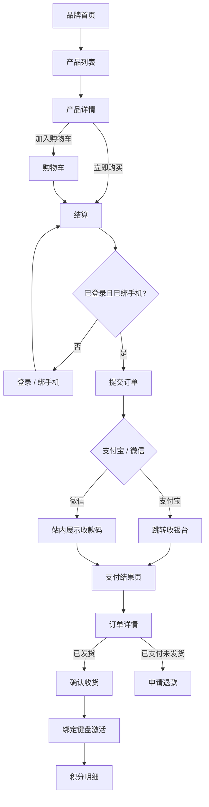
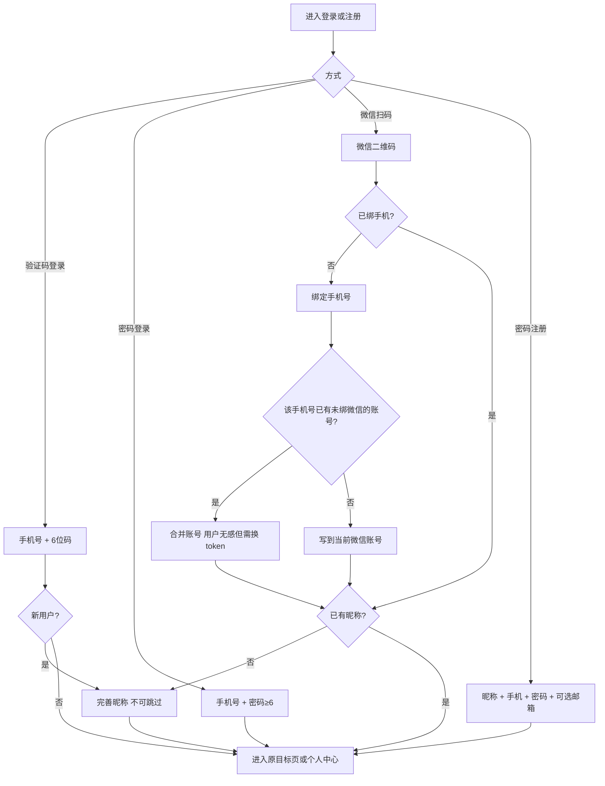
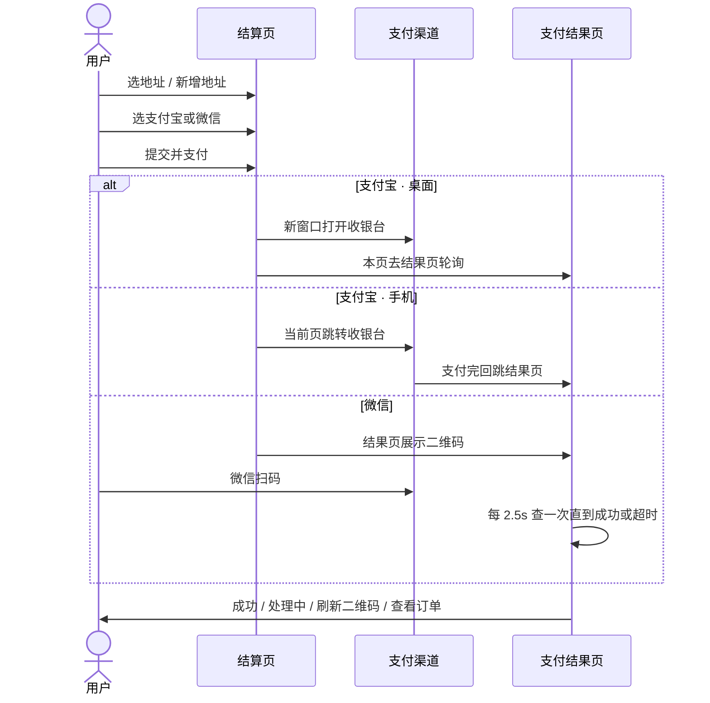
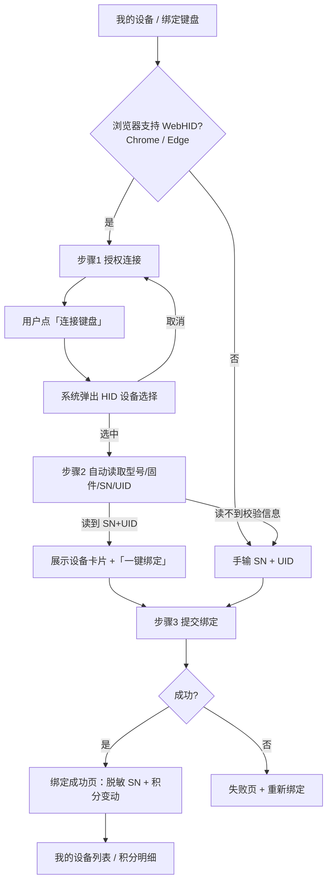

# UNIQMAG C 端页面流程 · 设计师手册

> 用途：供设计师**重新设计** `www.uniqmag.cn`（官网用户站）时对照。  
> 依据：现网 C 端代码（`webiste-future`）+ 已上线业务规则。  
> 日期：2026-08-17  
> 原则：**视觉、布局、动效、文案表达可以全部重做**；下文「必须保留」的是业务闭环，不是现有 UI。

---

## 0. 怎么用这份文档

| 你要做的事 | 看哪一节 |
|---|---|
| 先建立站点地图 | [2. 信息架构](#2-信息架构站点地图) |
| 画用户旅程 | [4. 核心旅程](#4-核心旅程) |
| 按页出稿 | [5. 逐页规格](#5-逐页规格) |
| 确认按钮能不能删 | [1.4 必须保留的业务规则](#14-必须保留的业务规则设计师不能砍掉) |
| 对现有体验的吐槽 / 欠账 | [6. 现网体验债](#6-现网体验债重设计时请一并处理) |

现网视觉仅作参考，不必沿用：OLED 黑底、主色 `#6669e3`、玻璃拟态。品牌名 **UNIQMAG / 一磁定音**，现售两款键盘 **UQ68**、**UQ71**。

---

## 1. 产品与用户

### 1.1 站点是什么

官网同时承担两件事：

1. **品牌站**：讲磁悬浮轴、TMR、驱动，拉新与信任。
2. **用户站**：登录、买键盘、查订单、绑设备领积分。

重设计时不要做成「纯宣传页 + 另开一个商城」。现网策略是：**产品详情即购买页**（故事 + 购买同屏）。

### 1.2 用户角色

| 角色 | 能做什么 | 不能做什么 |
|---|---|---|
| 游客 | 浏览品牌/产品/支持；**加购**（本地购物车） | 结算、看订单、地址、积分、设备 |
| 已登录未绑手机 | 看个人中心、改昵称；购物车仍走本地 | 结算 / 订单 / 地址 / 积分 / 设备 |
| 已登录已绑手机 | 全站交易与售后 | — |
| 已登录未完善昵称 | 会被强制拉去「完善昵称」（不可跳过） | 进入个人中心业务页 |

短信验证码登录会**自动建号**（手机号即账号）。微信扫码登录拿不到微信手机号，必须再绑号。

### 1.3 访问门槛（画线框图时请标出来）

```text
公开：首页、产品、软件、支持、关于、联系、登录、注册、购物车浏览
需登录：个人中心概览、完善昵称
需登录 + 已绑手机：结算、支付结果、订单、地址、积分、设备、更换手机号
```

被拦截时的去向：

- 未登录 → `/login`，登录成功后回到原页面（支付回跳带 query 必须保留）。
- 未绑手机访问业务页 → `/onboarding/mobile`（可跳过，但跳过后**回个人中心**，不回到结算页）。
- 未完善昵称 → `/onboarding/nickname`（**不可跳过**）。

### 1.4 必须保留的业务规则（设计师不能砍掉）

这些是后端已上线的契约，页面可以换样子，能力要在：

1. **三种登录**：短信验证码 / 密码 / 微信扫码。
2. **短信登录自动注册**；新用户必须完善昵称。
3. **微信登录后强制绑手机**（可从业务页跳过，但不能跳过后再去结算）。
4. **绑手机可能合并账号**（该手机号已有账号且未绑微信 → 合并到手机号账号）。
5. **游客可加购**；登录且绑手机后本地购物车与云端合并（同商品数量相加，单行上限 99）。
6. **两种购买路径**：加入购物车结算；「立即购买」直达结算且**不改购物车**。
7. **结算必须选收货地址 + 支付方式**（支付宝 / 微信）。
8. **未支付订单可继续支付**；已支付未发货可申请**全额退款**；已发货可**确认收货**（发货满 10 天自动确认）。
9. **设备绑定 = 激活**：必须同时提供 SN（16 位十六进制）+ UID（24 位十六进制）；优先 USB 线连接由浏览器读取，失败再手输。
10. **积分只展示流水**，现网**不能抵现、不能兑换**。来源：注册 / 下单 / 激活 / 退款扣回 / 人工调整。
11. 金额以人民币展示（后端存分）；手机号对外**脱敏**（`138****8000`），换绑时用户必须自己输入完整旧号。
12. 购物车里「已下架/缺货」的行必须先移除才能结算。

### 1.5 现网没有、不要当成已有功能去画

除非产品另行确认，否则稿子里不要画成已上线：

- 积分抵现 / 优惠券 / 满减活动页
- SKU 颜色作为可购买规格（现网颜色切换**只换图，不下单变体**；UQ68 / UQ71 各对应一个可售 SKU）
- 物流轨迹地图、开票、售后工单系统
- 修改已提交订单的地址
- 取消待支付订单（状态机有 `cancelled`，C 端无入口）
- 多语言 / 美元结算（支持页文案仍残留国际站内容，见第 6 节）

---

## 2. 信息架构（站点地图）

```text
UNIQMAG 官网
├── 品牌浏览（公开）
│   ├── /                 首页：Hero + Uniqlev 轴体 + TMR 芯片
│   ├── /products         产品系列列表（UQ68 / UQ71）
│   ├── /products/:id     产品详情 = 购买页（uq68 | uq71）
│   ├── /software         网页驱动 + 固件下载
│   ├── /support          帮助中心（FAQ / 运费 / 退货 / 条款 / 隐私）
│   ├── /about            关于我们
│   └── /contact          联系我们（表单 + 邮箱 + 微信公众号）
│
├── 账号
│   ├── /login            登录（验证码 / 密码 / 微信）
│   ├── /register         密码注册
│   ├── /auth/wechat/callback          微信扫码回跳（系统页，用户几乎看不见）
│   ├── /onboarding/mobile             绑定手机号
│   └── /onboarding/nickname           完善昵称
│
├── 交易
│   ├── /cart             购物车
│   ├── /checkout         确认订单（需绑手机）
│   └── /pay/result       支付结果 / 微信收款码（需绑手机）
│
└── 个人中心（需登录；子页需绑手机）
    ├── /account                    概览
    ├── /account/mobile             更换手机号
    ├── /account/orders             订单列表
    ├── /account/orders/:id         订单详情
    ├── /account/addresses          收货地址
    ├── /account/points             积分明细
    ├── /account/devices            我的设备
    ├── /account/devices/bind       绑定键盘
    └── /account/devices/bind/result 绑定结果
```

兼容跳转（用户不应直接到达，设计稿可忽略）：`/shop`、`/shop/:id` 会重定向到 `/products`。

### 2.1 主导航（现网）

**左**：Logo → 首页  
**中**（桌面）：首页 · 产品 · 软件 · 支持 · 关于我们 · 联系我们  
**右**：购物车（角标件数，>99 显示 99+）· 未登录「登录 / 注册」· 已登录头像+昵称（未完善昵称时文案为「完善昵称」）

移动端：汉堡菜单，同样包含购物车与账号入口。滚动后顶栏变半透明毛玻璃。

页脚：品牌一句话、快速链接（产品/驱动/关于/联系）、支持（FAQ/发货/退换/隐私）、备案号、服务条款。

重设计建议：账号与购物车是交易入口，品牌导航与「我的」在信息层级上要分开，避免移动端把购买路径埋进汉堡。

---

## 3. 全局交互约定

### 3.1 断点

现网以桌面品牌站为主，交易页在 `lg` 变双栏。重设计请同时出：

- **桌面** ≥1280：品牌大图 + 交易侧栏
- **平板** 768–1279：单栏，购买 CTA 仍可见
- **手机** <768：顶栏精简；结算/支付/绑定必须单手可完成

### 3.2 反馈形态（现网较简陋，可升级）

| 类型 | 现网做法 | 重设计可改成 |
|---|---|---|
| 加载 | 居中转圈 | 骨架屏 / 按钮内 loading |
| 成功 | 文案变绿，2 秒消失 | Toast / 轻提示 |
| 失败 | 表单下红字 | 字段级错误 + 页级错误 |
| 危险操作 | `window.confirm`（退款、确认收货、删地址） | 模态确认，文案写清后果 |
| 空状态 | 标题 + 一句说明 + 一个跳转按钮 | 可保留结构，换视觉 |

### 3.3 关键文案语气

交易页现网偏功能、少营销。品牌页偏科技叙事。重设计时建议：

- 品牌页：可以更有气质
- 登录 / 结算 / 支付 / 绑定：短、确定、不卖货；错误信息要可执行（「请输入 6 位验证码」而不是「失败」）

---

## 4. 核心旅程

### 4.1 总览



### 4.2 注册 / 登录 / 完善资料



**设计师要点**

- 登录页三个 Tab 必须都在：验证码（默认）、密码、微信。
- 获取验证码：手机号校验 `1[3-9]` 开头 11 位；按钮进入倒计时（默认 60s）。
- 微信 Tab：内嵌官方扫码框；未开通时提示「请使用手机号登录」。
- 扫码成功后有一页「正在完成微信登录…」，失败才露出「返回登录」。
- 绑定手机：可「暂时跳过」，但从结算等业务页进来时，跳过只能回个人中心。
- 完善昵称：1–32 个字符，无跳过。
- 登录成功后要回到拦截前的页面（例如从结算被踢来的，要回结算）。

### 4.3 购买两条路径

**路径 A · 购物车**

```text
产品页「加入购物车」
  → 角标 +1，可继续逛
  → 购物车改数量 / 删除
  → 去结算（未登录先登录，未绑手机先绑）
  → 提交后服务端清空购物车
```

**路径 B · 立即购买**

```text
产品页选数量 →「立即购买」
  → 结算页只显示这一件
  → 文案提示「单件直购，不影响购物车内商品」
  → 下单不改购物车
```

游客加购：详情页允许；列表页现网会先跳登录（不一致，重设计请统一为「加购不登录，结算才登录」）。

数量规则：1–99，且不超过库存。缺货时购买按钮禁用。

### 4.4 结算与支付



**设计师要点**

- 结算页模块顺序建议保持：**地址 → 支付方式 → 商品清单 → 金额侧栏 CTA**。
- 无地址时自动展开「新增地址」表单，不能只给空列表。
- 运费在提交前可能还没算出来，现网写「按运费规则计算，支付前确认」。重设计可做成「提交后展示含运费应付」，但不要假装已经有精确运费。
- 微信：用户不能离开站点去别的 App 内支付页，必须在站内看到**收款码 + 等待支付**。
- 支付宝桌面：会多一个收银台窗口，结果页要能独立轮询，文案写成「请在打开的窗口完成支付」。
- 超时未支付：提供「刷新二维码 / 重新拉起支付」+「去订单里继续支付」，不要只说失败。

### 4.5 履约（发货之后）

```text
待支付 → 已支付（待发货）→ 已发货 → 已完成
                ↘ 已退款（仅未发货全额退）
```

| 状态 | 用户可见操作 |
|---|---|
| 待支付 | 继续支付 |
| 已支付 | 申请全额退款（二次确认：仅未发货） |
| 已发货 | 确认收货（二次确认）；展示快递公司 + 单号 + SN；提示「发货满 10 天将自动确认」 |
| 已完成 / 已退款 / 已取消 | 只读 |

订单列表筛选：全部 / 待支付 / 已支付 / 已发货 / 已完成 / 已退款。分页「加载更多」。

### 4.6 绑定键盘（开箱后的关键路径）

这是硬件品牌差异化流程，请单独出高保真。



**必须交代给用户的信息**

- 用数据线连接键盘（不是蓝牙）。
- 浏览器会弹出授权窗口，要用户自己选设备。
- SN、UID 印在键盘**底部标签**；SN 16 位、UID 24 位，十六进制。
- 列表页**不展示 UID**（安全），只展示脱敏 SN、产品名、绑定/激活时间。
- 激活送积分：同一设备终身一次；成功页积分数字「以积分明细为准」。

---

## 5. 逐页规格

每页给出：目的、入口、模块、状态、主按钮、设计备注。文案为现网原文，可改写但请保留信息量。

---

### 5.1 首页 `/`

**目的**：3 秒内建立「无弹簧磁悬浮键盘」认知，导向产品或驱动。

**模块（自上而下，现网三屏）**

| # | 模块 | 内容 | 交互 |
|---|---|---|---|
| 1 | Hero 全屏 | 背景循环视频；徽章「全新 UQ71 系列现已发布」；主标题「0延迟，全掌控」；副题「重塑你的输入体验」；说明 8000Hz | 主 CTA「查看产品」→ `/products`；次 CTA「在线驱动」→ 外链 `https://drivers.szycdy.com/` |
| 2 | Uniqlev™ Switch | 左图（弹簧消散 GIF）/ 右文：无弹簧磁悬浮故事；标签「无接触 / 无摩擦 / 始终如一」 | 无跳转，纯叙事 |
| 3 | TMR 传感 | 左文右芯片图；三项指标：触发精度 / 信号处理 / 系统延迟 | 无跳转 |

**状态**：静态。视频需静音自动播放，尊重 `prefers-reduced-motion`。

**重设计建议**：Hero 可更产品化（直接露出 UQ71 实物 + 价格入口）；技术两屏建议可滑动或锚点，避免「长文难以下单」。至少保留一条通往购买的主路径。

---

### 5.2 产品列表 `/products`

**目的**：两款并列对比，能加购或进详情。

**页头**：标题「探索磁悬浮系列」；说明「现货可直接下单」。

**每张产品卡**

- 大图（可点色点换图，**不改价格/SKU**）
- 标签、名称、slogan
- 价格（来自后台，同步中显示「同步价格中…」；对不上 SKU 则「详情页了解产品」）
- 库存：「现货 N」或「暂时缺货」
- 色点 + 当前色名 +「详情」
- 可售：`加入购物车` + `立即购买`
- 不可售：只留 `了解更多`

**状态**

| 状态 | 表现 |
|---|---|
| 加载价格 | 「同步价格中…」，购买按钮按是否可售出现 |
| 可售 | 双 CTA |
| 缺货 / 未上架 | 了解更多 |
| 加购成功 | 「已加入购物车」约 2 秒 |

**现网问题**：列表「立即购买」未绑手机时可能直接进结算再被踢走；详情页会先拦绑手机。请统一拦截时机。

---

### 5.3 产品详情 `/products/uq68` · `/products/uq71`

**目的**：品牌故事 + 同页购买。这是转化核心页。

**布局（现网）**

```text
返回列表
左 3/5：产品大图（随颜色切换）
右 2/5：标签、名称、slogan、选颜色、购买面板
↓ 核心亮点（3～4 张卡片）
↓ 技术规格 + 使用场景标签
```

**购买面板状态机**

| 状态 | UI |
|---|---|
| 同步中 | 「正在同步价格与库存…」 |
| 未开放 / 下架 | 「暂未开放购买…」+ 查看购物车 |
| 可售 | 价格大字、现货数、运费提示（若有）、数量步进、加入购物车、立即购买 |
| 缺货 | 数量与 CTA 禁用，「暂时缺货」 |
| 加购成功 | 「已加入购物车」 |

**颜色选择**：只换渲染图与色名，**不要设计成可选 SKU**。若未来要做配色下单，需产品/后端另开规格，不在本次「按现网流程重设计」范围内。

**404**：未知 `:id` →「产品未找到」+ 返回列表。

---

### 5.4 软件 `/software`

**目的**：去网页驱动、下固件。驱动是外链产品，本页是跳板。

**模块**

1. 页头：固件与驱动
2. 在线驱动：卖点四宫格（灯光、触发行程、高级按键、宏）+「打开网页驱动」外链 + 驱动 UI 示意（装饰，非真控制台）
3. 提示条：「固件更新已发布…」
4. 固件下载：UQ68 / UQ71 两张卡，外链下载

**注意**：固件链接现网仍指向旧国际站，重设计时预留「版本号 / 更新日期 / 适用机型」，避免只有一个无说明的下载按钮。

---

### 5.5 支持 `/support`

**目的**：自助查阅政策；解决不了去联系。

**结构**：左栏锚点（或移动端顶 Tab）+ 右栏内容。

| Tab | 内容类型 |
|---|---|
| 常见问题 | 手风琴 FAQ |
| 运输政策 | 政策长文 |
| 退货退款 | 政策长文 |
| 服务条款 | 政策长文 |
| 隐私政策 | 政策长文 |

侧栏底部：「需要更多帮助？」→ `/contact`

**务必重写文案**：现网 FAQ 仍写美元满 $150 包邮、PayPal / Apple Pay 等，与真实支付（支付宝/微信、人民币、后台运费规则）不符。重设计时政策页应改成可运营配置的内容结构，而不是写死在视觉里。

---

### 5.6 关于我们 `/about`

**模块**：品牌 Hero 大图文 → 品牌故事长文 → 核心技术 → 团队 → 里程碑。纯内容，无表单。可做成杂志式，不必保留现网玻璃卡片。

---

### 5.7 联系我们 `/contact`

**左**：标题、邮箱（售前 / 售后 / 商务）、工作时间、地址、微信公众号二维码。  
**右**：表单。

| 字段 | 规则 |
|---|---|
| 姓名 | 必填 |
| 邮箱 | 必填 |
| 主题 | 售前咨询 / 售后支持 / 商务合作 / 其他事项 |
| 留言 | 必填 |

提交中按钮 loading；成功清空表单并提示「消息已发送…」；失败展示错误。这是官网自己的留言接口，**不是**账号体系。

---

### 5.8 登录 `/login`

**未登录才展示**；已登录自动跳走。

**结构**：居中卡片，宽约 448px。

- 眉题 `UNIQMAG ID`，标题「登录账号」
- 三段切换：验证码 / 密码 / 微信
- 验证码模式：手机号、验证码 +「获取验证码」、主按钮「登录」
- 密码模式：手机号、密码（可显隐）、主按钮「登录」
- 微信模式：官方二维码，无主按钮
- 底：「还没有账号？注册」

**校验**

- 手机号非法 →「请输入有效的中国大陆手机号」
- 验证码非 6 位数字 →「请输入 6 位验证码」
- 密码 < 6 位 →「密码至少 6 位」
- 接口错误原文展示（如「请使用验证码登录或先设置密码」）

**跳转优先级**：需绑手机 → 绑手机页；新用户 → 完善昵称；否则 → 登录前想去的页面。

---

### 5.9 注册 `/register`

标题「创建账号」；说明「手机号 + 密码注册，注册成功后可直接进入个人中心」。

| 字段 | 必填 | 规则 |
|---|---|---|
| 昵称 | 是 | 1–32 字符 |
| 手机号 | 是 | 大陆 11 位 |
| 邮箱 | 否 | email |
| 密码 | 是 | ≥6 位 |
| 确认密码 | 是 | 与密码一致 |

主按钮「注册并进入个人中心」；底「已有账号？去登录」。  
注册成功一般已带昵称，直接进个人中心（无需再走完善昵称）。

---

### 5.10 绑定手机号 `/onboarding/mobile`

**何时出现**：微信登录后无手机号；或访问结算/订单等被拦截。

- 图标 +「绑定手机号」
- 说明：「绑定后才能下单、管理地址与设备。可先跳过，之后在个人中心随时绑定。」
- 手机号、验证码、主按钮「确认绑定」
- 次按钮：业务强制时「暂时不绑，回个人中心」；否则「暂时跳过」
- 第三操作：「换个账号登录」（退出）

绑成功：若无昵称 → 完善昵称；否则回原页面（业务强制且跳过则不回结算）。

---

### 5.11 完善昵称 `/onboarding/nickname`

无跳过。说明里带脱敏手机号（若已有）。主按钮「完成并进入个人中心」。占位「怎么称呼你」。

---

### 5.12 购物车 `/cart`

**布局**：左商品列表，右粘性结算卡（桌面）；移动端建议底栏固定结算。

**列表行**：封面、标题（点进对应产品）、SKU、单价、数量步进、删除、缺货标签「已下架/缺货」。

**侧栏**：商品合计、说明「运费将在结算页按规则计算」、主按钮。

| 状态 | UI |
|---|---|
| 加载且无缓存 | 转圈 |
| 空车 | 「购物车是空的」→ 浏览产品 |
| 有缺货行 | 结算禁用，提示「N 件商品已下架或缺货，移除后才能结算」 |
| 未绑手机 | 主按钮文案改「先绑定手机号」 |

页头右侧「继续选购」。

---

### 5.13 结算 `/checkout`

需登录 + 已绑手机。

**页头**：标题「确认订单」；直购时副文「单件直购，不影响购物车内商品」。

**左栏三块**

1. **收货地址**  
   - 地址卡片单选，默认地址带「默认」  
   - 「新增」展开表单：收货人、手机号、省、市、区/县、详细地址  
   - 「管理地址」→ 地址页  
   - 无地址时表单默认展开，不能取消
2. **支付方式**  
   - 支付宝（注：跳转收银台）  
   - 微信支付（注：微信扫码）
3. **商品清单**  
   - 封面、标题 × 数量、小计；缺货行提示并链回购物车

**右栏**

- 商品金额  
- 运费：「按运费规则计算，支付前确认」  
- 主按钮「提交并支付」 / 提交中「正在下单…」  
- 辅助说明随渠道变化

空结算（没商品）：空状态回产品列表。

地址校验：收货人、省市、详细地址必填；手机号 11 位。

---

### 5.14 支付结果 `/pay/result`

窄版结果页，用户从支付宝回跳或微信出码后停在这里。

| 状态 | 标题 | 内容 | 按钮 |
|---|---|---|---|
| 等待首次查询 | 正在确认支付结果 | 「请稍候，勿关闭页面」 | — |
| 微信待付 | 微信扫码支付 | 二维码 +「等待支付结果」+ 订单号/金额/状态 | 刷新二维码、查看订单、返回产品 |
| 已支付 | 支付成功 | 订单号、金额、状态、支付时间 | 查看订单（主）、返回产品 |
| 超时仍未付 | 支付处理中 | 提示去「我的订单」查看 | 重新拉起支付 / 刷新码 |
| 缺参数 | 支付结果 | 「缺少订单信息」 | 返回产品 |

微信轮询更长（约 5 分钟），支付宝较短。成功判定含：已支付 / 已发货 / 已完成等。

---

### 5.15 个人中心概览 `/account`

需登录；未绑手机也可进（以便去绑定）。

**页头**：「你好，{昵称}」+「退出登录」  
**二级导航**：概览 / 订单 / 地址 / 积分 / 设备（横向胶囊，移动端可横滑）

**左卡 · 资料**

- 头像字、昵称、手机号或「未绑定手机号」
- 未绑：主按钮「绑定手机号」
- 账号资料：编辑昵称（行内表单）；已绑则可「更换」手机号

**右 · 快捷入口**

| 标题 | 说明 |
|---|---|
| 我的订单 | 查看物流与申请退款 |
| 收货地址 | 管理默认收货信息 |
| 积分明细 | 查看积分流水 |
| 我的设备 | 已绑定键盘与 SN |
| 绑定键盘 | 输入 SN 激活设备 |
| 产品选购 | 了解系列并直接下单 |

---

### 5.16 更换手机号 `/account/mobile`

两组并列字段，不要做成「只改一个号」：

1. 当前完整手机号 + 验证码（用户看到的是脱敏号，这里必须手输完整号）
2. 新手机号 + 验证码（须未被占用）

主按钮「确认更换」；成功回概览。新旧号不能相同。**不合并账号**，历史订单收货手机号不变。

---

### 5.17 订单列表 `/account/orders`

筛选胶囊 + 订单卡片列表。

**卡片信息**：订单号、下单时间、状态徽章、商品名摘要、金额。整卡可点进详情。

空：「暂无订单」→ 去商城。失败：错误空状态。底部「加载更多（已加载/总数）」。

**状态徽章颜色建议（现网）**

| 状态 | 色相 |
|---|---|
| 待支付 | 琥珀 |
| 已支付 | 蓝 |
| 已发货 | 紫 |
| 已完成 | 绿 |
| 已退款 / 已取消 | 灰 |

---

### 5.18 订单详情 `/account/orders/:id`

返回列表。模块：

1. 标题 + 订单号 + 状态
2. 商品行：图、标题、SKU × 数量、行金额；发货后展示 SN 列表
3. 收货信息快照（下单时冻结，不能改）
4. 物流：公司 + 单号 + 发货时间；已发货时提示 10 天自动确认
5. 金额：商品+运费合计，并拆出运费；支付渠道中文名
6. 操作区：见 [4.5](#45-履约发货之后)

危险操作需确认：

- 退款：「确认申请全额退款？仅未发货订单可退。」
- 收货：「确认已收到货物？确认后订单将完成。」

---

### 5.19 收货地址 `/account/addresses`

页头「新增地址」。列表：姓名+手机、省市区+详情、默认标记、编辑、删除。

表单字段：收货人、手机号、省、市、区/县、详细地址、设为默认。  
第一条地址建议默认勾选「设为默认」。删除需确认。

空状态：「还没有收货地址」。

---

### 5.20 积分 `/account/points`

上：当前积分大数字。  
下：流水列表（原因、时间、备注、变动 +/-、变动后余额）。

原因文案映射：

| 内部码 | 展示 |
|---|---|
| register | 注册奖励 |
| order | 下单奖励 |
| order_refund | 订单退款扣回 |
| activate | 激活奖励 |
| adjust | 人工调整 |
| merge | （微信合账，现网未单独翻译，请补「账号合并转入」） |

空：「暂无积分流水」→ 绑定键盘。明确告诉用户：**积分暂不可抵扣订单**。

---

### 5.21 我的设备 `/account/devices`

页头「绑定键盘」。列表卡片：产品名、SKU、脱敏 SN、绑定时间、激活时间。**不要展示 UID。**

空：「还没有绑定设备」→ 去绑定。

---

### 5.22 绑定键盘 `/account/devices/bind`

窄版。返回「我的设备」。

**步骤条（3 步）**：授权连接 → 自动读取 → 完成绑定

**A. 支持 HID 且尚未读到设备**

- USB 图标、「连接您的 UNIQMAG 键盘」
- 「点击后浏览器会弹出授权窗口,选择您的键盘并确认」
- 主按钮「连接键盘」
- 弱入口「无法连接?手动输入 SN / UID 绑定」

**B. 已识别**

- 设备卡：`{型号} 磁轴键盘`、设备名、固件版本、「重新连接」
- 读到 SN+UID：绿字「设备校验信息已自动读取」+「一键绑定」
- 读不到：引导手输底部标签

**C. 手输（不支持 HID 或用户选择）**

- 说明建议 Chrome / Edge
- SN 16 位、UID 24 位，等宽字体、自动转大写
- 「确认绑定」

错误原文展示（取消授权不报错，回到可点连接）。

---

### 5.23 绑定结果 `/account/devices/bind/result`

| 成功 | 失败 |
|---|---|
| 「绑定成功」+ 脱敏 SN + 可选积分变动 | 「绑定失败」+ 原因 |
| 主按钮「查看设备」；次「积分明细」 | 主「查看设备」；次「重新绑定」 |

---

### 5.24 系统页（设计稿可极简，但要有失败态）

| 页 | 正常 | 失败 |
|---|---|---|
| `/auth/wechat/callback` | 「正在完成微信登录…」 | 「微信登录失败」+ 返回登录 |
| 任意需登录页在校验 token 时 | 全屏转圈 | token 失效回登录 |

---

## 6. 现网体验债（重设计时请一并处理）

按对转化/信任的影响排序：

1. **支持/政策文案与真实交易不符**（美元、PayPal、国际退货邮箱）。用户下单后若去支持页会感到两个站点。
2. **颜色看起来像规格，实际买不到该配色 SKU**。要么文案写清「效果图」，要么产品侧真做多 SKU。
3. **加购登录策略不统一**（列表要登录，详情不要）。建议全部「加购免登录」。
4. **结算页运费不透明**，支付前才知道应付总额。
5. **危险操作用浏览器原生 confirm**，品牌感断裂，且移动端体验差。
6. **绑定流程对非 Chrome 用户不友好**，手输 SN/UID 认知成本高，需要配底部标签示意图。
7. **积分能看不能用**，若仍不开放抵现，概览里不要做成「资产卡片」以免期待错位。
8. **产品列表立即购买**未处理「未绑手机」的直购 resume，可能丢「立即购买」上下文。
9. 联系页邮箱域名为 `uniqmagx.com`，与现网 `uniqmag.cn` 品牌域并存，对外物料需统一。

---

## 7. 建议的设计交付切分

方便分稿、评审、开发对照：

| 批次 | 页面 | 原因 |
|---|---|---|
| A. 品牌首页与产品 | 首页、列表、详情、软件 | 对外第一印象与转化 |
| B. 交易闭环 | 购物车、结算、支付结果、订单列表/详情 | 已上线闭环，视觉可换不能断 |
| C. 账号 | 登录、注册、绑手机、完善昵称、换手机、个人中心 | 门槛页，决定能否下单 |
| D. 硬件激活 | 设备列表、绑定、绑定结果、积分 | 开箱后留存 |
| E. 信任页 | 支持、关于、联系、页脚 | 必须与批次 B 的支付/退款规则对齐 |

每页请至少交付：**桌面 1440、手机 390**；交易与绑定页加 **空 / 加载 / 错误 / 成功** 四态。结算、支付、绑定建议再加一张**用户旅程注解稿**（箭头 + 拦截条件），避免开发漏掉绑手机跳过逻辑。

---

## 8. 组件级清单（方便出组件库）

不必与现网 1:1，但这些节点在稿子里要能对上：

- 顶栏、页脚、移动菜单
- 按钮：主（实心浅色）、次（描边）、文字、危险
- 数量步进器（最小 1，最大 min(库存, 99)）
- 价格（¥ 千分位，两位小数）
- 状态徽章（6 种订单状态）
- 空状态
- 表单：手机号、验证码+倒计时、密码显隐、地址多字段
- 地址选择卡片、支付方式选择卡片
- 商品行（图 + 标题 + SKU + 数量 + 金额）
- 个人中心二级导航
- 支付结果插画/状态（成功、等待扫码、处理中）
- 绑定三步进度、HID 授权示意、底部标签 SN/UID 示意图
- Toast / 模态确认（替换原生 confirm）

---

## 9. 关键字段速查（画表单用）

| 场景 | 字段 | 限制 |
|---|---|---|
| 手机号 | 11 位数字 | `^1[3-9]\d{9}$` |
| 验证码 | 6 位数字 | 发送冷却约 60s，有效约 5 分钟 |
| 密码 | 字符串 | 至少 6 位 |
| 昵称 | 字符串 | 1–32 个字符（按 Unicode 字符计） |
| 地址 | 姓名、手机、省、市、区、详情、默认 | 区可空，其余现网结算会校验省市+详情 |
| 购物车数量 | 整数 | 1–99，且 ≤ 库存 |
| 设备 SN | 16 位十六进制 | 展示时脱敏 |
| 设备 UID | 24 位十六进制 | 仅绑定输入，列表不展示 |
| 金额 | 分 | 界面用人民币元 |

支付渠道值：`alipay` / `wechat`。订单状态值见 [4.5](#45-履约发货之后)。

---

## 10. 给设计评审的一句话

这不是从 0 规划商城，而是 **品牌站与已跑通的交易/激活闭环共用一个站点**。重设计的成功标准是：品牌气质升级的同时，**未登录加购 → 登录绑手机 → 结算支付 → 查物流确认收货 → 绑键盘激活** 这条路径在手机上仍然一眼能走完，中途每一次拦截都告诉用户「还差哪一步、做完去哪」。
